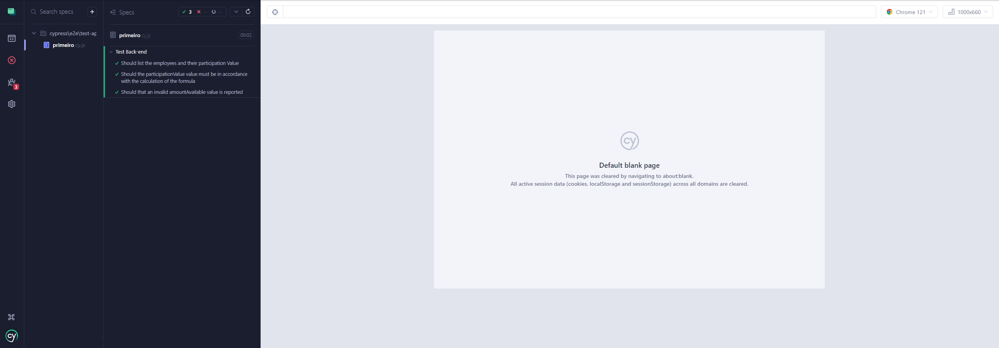
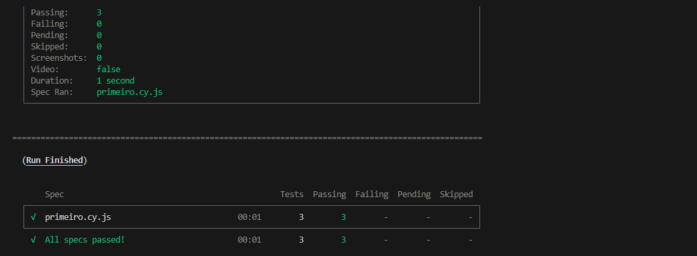

# ProfitDistribution-test

## Tecnologias
* [Cypress](https://docs.cypress.io/guides/getting-started/installing-cypress)
* [Node.js](https://nodejs.org/en)

## Arquitetura do Projeto

## PASSO A PASSO PARA EXECUTAR AUTOMAÇÃO

### 1° - É necessário ter as seguintes tecnologias instalados:

* [Cypress](https://docs.cypress.io/guides/getting-started/installing-cypress)
* [Node.js](https://nodejs.org/en)
* [Visual Studio Code](https://code.visualstudio.com/)

### 2° - Clonar o repositório do GitHub:

Para ter acesso ao repositório:
```bash
https://github.com/lucassillva/ProfitDistribution-test.git
```

### 3° Execute o comando
```shell
npm install
```

### 4° Abrir o projeto no Visual Studio Code:

Para o desenvolvimento do teste automatizado foi utilizado o Visual Studio Code, no entanto, é recomendado ter a ferramenta instalada na máquina. Caso tenha instalado corretamente, abra o projeto clonado do GitHub.

### 5° Execução dos testes automatizados

#### 5.1 Primeira Maneira de Executar Testes Automatizados
Para executar o projeto, é necessário digitar um dos seguintes comandos:

```shell
npx Cypress open
```



#### 5.2 Segunda Maneira de Executar Testes Automatizados

Outra forma de executar a automação é:
```shell
npx Cypress run
```

